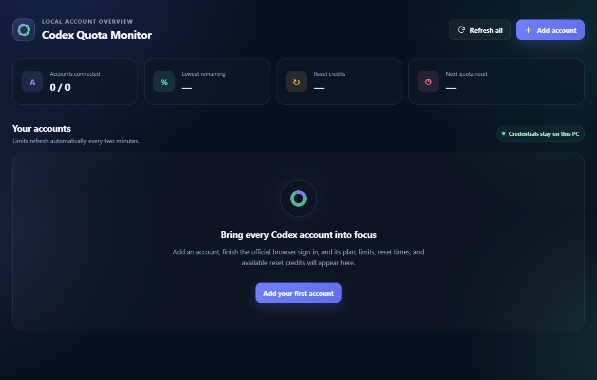

# Codex Quota Monitor

Codex Quota Monitor is a local Windows desktop dashboard for viewing Codex subscription limits across multiple accounts you are authorized to access. It is published by Nagu Corporate Private Limited.

> **Release status: public release candidate; certification and support pending.** [`v1.5.0-rc.13`](https://github.com/nagu-code/codex-quota-monitor/releases/tag/v1.5.0-rc.13) is publicly downloadable, but it is an uncertified, unsupported prerelease. Its assets use final-shaped `1.5.0` filenames; those filenames do not make it official, certified, or supported. Only a future non-prerelease `v1.5.0`, approved after Phase 8 certification and the Phase 9 audits, will be the official release. Use RC13 only if you knowingly accept prerelease risk, and follow its installation and verification guidance. The canonical [Codex Quota Monitor product website](https://codex-tracker.nagu.co/) and [GitHub Releases page](https://github.com/nagu-code/codex-quota-monitor/releases) remain the official distribution channels.

## What it does

- Monitors multiple Codex accounts that you explicitly connect and are authorized to use.
- Shows each account's current ChatGPT plan, one canonical Codex quota window, the exact remaining percentage, the next reset time and live countdown, reset-bank balance, and connection state.
- Offers a sortable, per-column-filterable table and a card grid.
- Builds aggregate and selected-account history for one, two, or three months from quota observations recorded locally after an account is connected.
- Supports account multiselect and mouse or keyboard chart tooltips showing used and remaining percentages.
- Keeps login state honest: a retry timer never marks an account active; identity and the canonical Codex limit must verify first.

The app intentionally excludes Spark, reserve, secondary, and purchased-balance buckets along with token, model, prompt, response, and conversation analytics.

## Interface preview

The preview contains no connected-account data. Quota history begins when the app records observations; the Codex rate-limit response does not provide retroactive history.

## System requirements

- Windows 10 or Windows 11, x64
- A current Windows user account that can install a per-user application
- Internet access and a browser for the official ChatGPT sign-in flow

No Node.js installation or source checkout is required to use the compiled Windows application.

## Download and install

RC13 is available from the official [GitHub Releases page](https://github.com/nagu-code/codex-quota-monitor/releases), subject to the prerelease warning above. Download only from that page or through the canonical [product website](https://codex-tracker.nagu.co/), and verify independently published SHA-256 values before opening any installer. The final-shaped filenames below identify RC13 assets; they are not evidence of certification or final-release status.

Two Windows distributions are available in RC13:

1. **Unsigned EXE — simplest option:** `Codex-Quota-Monitor-Setup-1.5.0-x64-Unsigned.exe`. It has no Authenticode publisher signature, so Windows can show **Unknown publisher** or a SmartScreen warning. Continue only after the complete SHA-256 value and expected unsigned status have been verified.
2. **Locally self-signed ZIP — advanced trust-assisted option:** `Nagu-Codex-Quota-Monitor-1.5.0-Locally-Signed.zip`. It includes the locally self-signed installer, Nagu's public certificate, current-user trust and trust-removal scripts, legal notices, hashes, and a detached checksum signature. A Nagu self-signed certificate is not equivalent to a publicly trusted certificate-authority signature. Installing it into the current user's trust stores extends trust beyond this one app, and uninstalling the app does not remove that trust.

Read [INSTALLATION.txt](INSTALLATION.txt) in full before downloading or installing. It contains the authoritative filenames, verification commands, certificate checks, sign-in guidance, troubleshooting, uninstall, and trust-removal steps. Do not bypass Windows or organization security policy.

## Privacy: local by design

Codex Quota Monitor has no advertising, analytics, telemetry, or external application backend. Authentication is performed by the bundled OpenAI Codex client through the official browser sign-in flow. The app contacts the services required for that authentication and for the canonical account rate-limit response; “local-only” does not mean the official online sign-in and quota checks happen offline.

Account metadata and a bounded history of canonical quota observations stay under the current Windows user's application-data directory. The app does not scan Codex conversations or local session logs and does not collect prompts, responses, model activity, or token history.

See the full [desktop application privacy notice](PRIVACY.md).

## Credential and application security

Saved credentials are encrypted for the current Windows user with Electron safe storage backed by Windows Data Protection API (DPAPI), and encryption is verified before plaintext is removed. The Codex App Server can require a short-lived plaintext `auth.json` while starting or refreshing authentication; the monitor captures the latest credential into the verified DPAPI vault and removes that file. If a crash interrupts cleanup, the next launch attempts to re-seal the recoverable credential.

Another Windows user or a copied profile normally cannot decrypt the saved credentials. The Electron application also uses a sandboxed renderer, context isolation, a restrictive content security policy, allowlisted browser-authentication URLs, validated privileged-message senders, and hardened Electron fuses.

Never send access tokens, cookies, `auth.json`, account-data folders, or local account-home directories in a support or security report.

See the [security policy and responsible-disclosure guidance](SECURITY.md).

## License

The application is proprietary freeware, not open source. Subject to the full license, official unmodified binaries may be used without a license fee for personal, workplace, internal business, professional, and other commercial activities.

Redistribution is limited to exact, official, unmodified releases with required filenames, signatures, verification material, and legal notices intact. Resale, sublicensing, modified redistribution, and redistribution of proprietary source are not permitted, subject to applicable law. Read the complete [Nagu Codex Quota Monitor Freeware License v1.0](LICENSE.txt) and [third-party notices](THIRD-PARTY-NOTICES.md); the full license controls if this summary differs from it.

## Support and responsible disclosure

- General help and installation support: [hello@nagu.co](mailto:hello@nagu.co)
- Privacy, security, publisher, and legal contact: [kj@nagu.co](mailto:kj@nagu.co)

Report suspected vulnerabilities privately and omit credentials and personal account data. More detail is available in [SUPPORT.md](SUPPORT.md).

## Official websites, publisher, and trademarks

- Canonical product website: [codex-tracker.nagu.co](https://codex-tracker.nagu.co/)
- Publisher website: [Nagu](https://nagu.co/)

Powered and shipped by Nagu Corporate Private Limited.

Codex Quota Monitor is an independent product from Nagu Corporate Private Limited. It is not affiliated with, endorsed by, or sponsored by OpenAI. OpenAI, ChatGPT, and Codex are trademarks or registered trademarks of their respective owners. Their names are used only to identify compatibility and the service the product monitors.

See [TRADEMARKS.md](TRADEMARKS.md) for the full independence and trademark notice.
